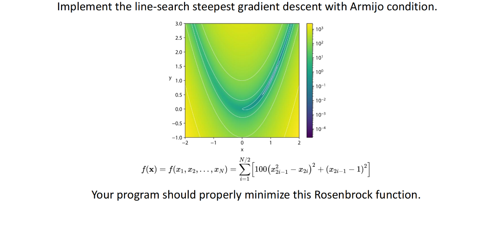
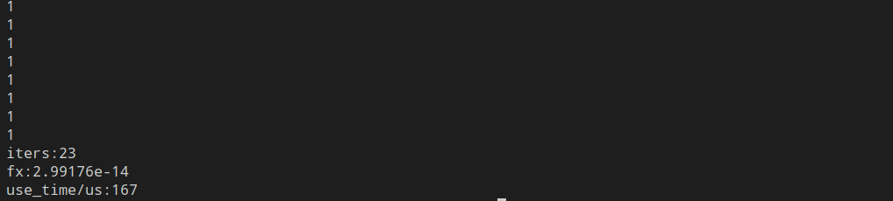

# L-BFGS
Note: This is a solver for **unconstrained optimization problems** that can handle general non-convex problems and require a smooth cost function.
## 1. dependencies
eigen3

CMake(>=3.0)

## 2. How to use?
```bash
mkdir build
cd build
cmake ..
make
./rosenbrock
```
## Examples-RosenBrock

